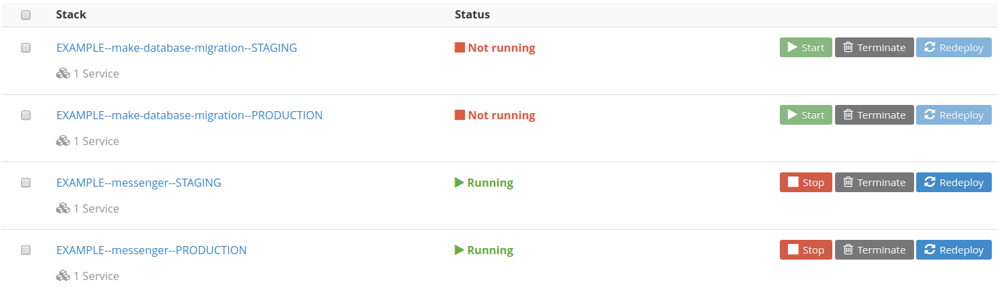

# docker-cloud-example

Docker Cloud example - how to run your Docker Compose projects in a cloud.

## Overview

Here is a simple Flask application called `messenger` returning "Hello <something>!".
This application is deployd to Docker Cloud with two environments:

- staging - http://web.example--messenger--staging.ac85ef32.svc.dockerapp.io:8080/
- production - http://web.example--messenger--production.fe14dd84.svc.dockerapp.io/

This links is persistent between application redeploys.

## Development

To start development process:

```bash
git clone git@github.com:respect31/docker-cloud-example.git
cd docker-cloud-example
virtualenv .python -p python2
source .python/bin/activate
make install
cp .env.example .env
editor .env # set your values
set -a; source .env
```

Now we could run our simple Flask application:

```bash
$ python -m messenger.server
    * Running on http://0.0.0.0:8080/ (Press CTRL+C to quit)
    * Restarting with stat
    * Debugger is active!
    * Debugger pin code: 144-476-680
    127.0.0.1 - - [25/Apr/2016 09:55:53] "GET / HTTP/1.1" 200 -
```

Open `localhost:8080` to see `Message: Hello Development!` or
any other message you've set in `.env` file.

Also we could run our application using Docker:

```bash
$ make build
$ docker-compose -f stacks/messenger.yml up
    Starting stacks_web_1
    Attaching to stacks_web_1
    web_1  |  * Running on http://0.0.0.0:8080/ (Press CTRL+C to quit)
    web_1  |  * Restarting with stat
    web_1  |  * Debugger is active!
    web_1  |  * Debugger pin code: 140-463-254
    web_1  | 172.17.0.1 - - [25/Apr/2016 07:59:28] "GET / HTTP/1.1" 200 -
```
Again open `localhost:8080` to see our application working. But for now
it uses docker containers.

In the latest example we use `stack` - let's explain it in the next section.

## Stacks

The main concept of Docker Cloud is `stacks`. `stack` is a collection of
services described in Docker Compose form. So all your Docker Compose files
could be a Docker Cloud stack files but with some keys not yet supported
(see https://docs.docker.com/docker-cloud/feature-reference/stack-yaml-reference/).

Stack file example:

> stacks/messenger.yml

```
# {"namespace": "example", "environments": ["staging", "production"]}

web:
  image: "${IMAGE}"
  command: python -m messenger.server
  restart: always
  ports:
    - "${PORT}:${PORT}"
  environment:
    PORT:
    DEBUG:
    MESSAGE:
```

On top of this YAML file we use magic line to tell our
deployment system how to push this stack to Docker Cloud
(see https://github.com/respect31/docker-cloud-example/issues/1).

So this stack file will lead to the following Docker Cloud stacks:
- EXAMPLE--messenger--STAGING
- EXAMPLE--messenger--PRODUCTION

**Store all your stack files in `stacks` directory so it will be
pushed to Docker Cloud automatically by `scripts/push-stacks.py` script**

We recomend to use nouns for auto restarting applications like `messanger` and
use verb form like `make-database-migration` for one time scripts
you need to run against your infrastucture.

Here we've run into environments concepts - let's
stay on it in the next section.

## Environments

Most part of web applications need minimum two environments to deploy into:
- staging
- production

With Docker Cloud we could use 12 Factor App methodolody (http://12factor.net/)
but we need to adopt it to the `stack` pushing workflow.

To accomplish this task we're going to use our CI/CD server to set
environment variables to our stack files while pushing it to Docker Cloud.

What does it mean?

In the repository code we have stack files without values of environment
variables (some could be hard-coded of course). When we call `docker-compose`
or `docker-cloud` process environment variables substitute this empty values.
So our stack files are like templates. On CI/CD we render this templates
with actual environment variables to push rendered stack files to Docker Cloud.

Current implementation of pushing system use environment suffixes to set
variables for different environments. So in our CI/CD `Travis CI` settings
for the project we should have something like this:

```bash
DOCKER_EMAIL=<secure>
DOCKER_USER=<secure>
DOCKER_PASS=<secure>
PORT__STAGING=8080
PORT__PRODUCTION=80
MESSAGE__STAGING="Hello Staging!"
MESSAGE__PRODUCTION="Hello Production!"
DEBUG=0
IMAGE=roll/example
```

There are also Docker Cloud credentials to interact with our account.

## Pushing

For now we have enough basics to understand what's happening on CI/CD server
(see `.travis.yml` and `Makefile` - it's a very simple code):
- git push triggers CI/CD build
- server installs and builds our application
- server runs tests
- server logins to Docker Cloud
- server push builded image to Docker Hub
- server render and push all stacks from `stacks` directory to Docker Cloud

**Here is no deployment has happend. We just having in sync our Github
repository code, Docker Hub image and Docker Cloud stack on green build!**

If for now we have our application working on Docker Cloud it's still
working based on previous version of deployment.

## Deployment

To make an actual deployment go to the Docker Cloud account:



Simpe workflow to redeploy (use the buttons on the right):
- stop running prevous version of `messenger`
- redeploy `make-database-migration`
- redelpoy `messenger`

Of course it could be much more interesting. It could use `Makefile`
to automatically redeploy `staging` for example etc. But the main
concept of Docker Cloud delpoyment (it's just one of strategies of
course) is here.

Thanks for the reading!
